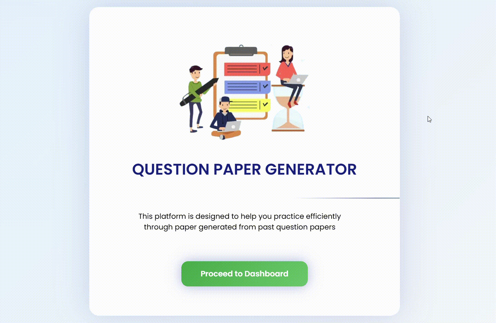
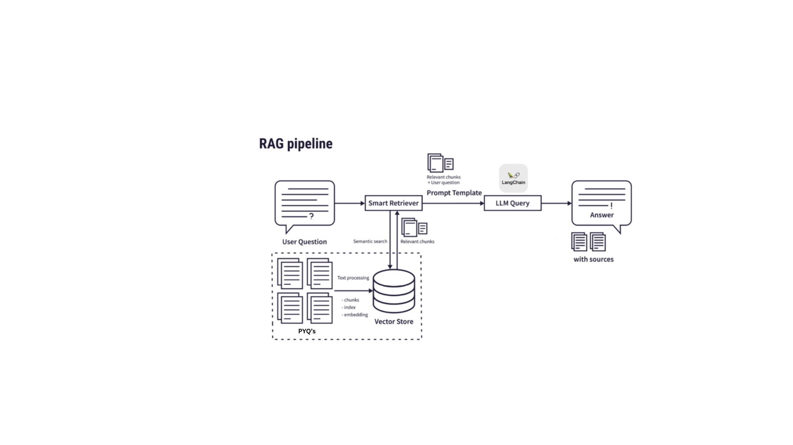

# Question Paper Generator


## Web Application: 



## Introduction:
This project is an Question Paper Generator built using Retrieval-Augmented Generation (RAG). It analyzes past question papers to understand patterns, topic distributions, and difficulty levels, then generates new question papers that closely match real exam formats. By combining semantic retrieval with large language models, the system ensures that generated papers are relevant, structured, and aligned with academic standards, making it useful for students, educators, and institutions for practice and assessment preparation

## Problem Statement: 
Educational institutions and students often face difficulty in creating high-quality question papers that accurately reflect exam patterns, syllabus coverage, and difficulty balance. Traditional paper setting is time-consuming, requires expert effort, and may lack consistency or variety. Additionally, students preparing for exams have limited access to diverse practice papers that mirror real test conditions. Therefore, there is a need for an intelligent system that can automatically generate structured, relevant, and balanced question papers based on analysis of past exam papers, reducing manual workload while improving exam preparation quality
## RAG Pipeline


### Data Ingestion,Data Cleaning and Preprocessing:
The process begins by collecting past question papers from various sources in formats such as PDF, DOCX, or text. These files are processed using document parsing tools to extract raw textual content, which serves as the foundational dataset for the system.The extracted text is cleaned to remove unwanted elements such as headers, footers, page numbers, and formatting inconsistencies. The content is normalized and structured so that individual questions, marks, sections, and topics can be clearly identified and prepared for further processing.

### Text Chunking:
Once cleaned, the text is divided into smaller semantic chunks. This step ensures that each segment contains meaningful information, allowing the system to retrieve relevant context efficiently during the query stage.

### Embedding Generation and Vector Database Storage:
Each text chunk is converted into a numerical vector representation using a transformer-based embedding model. These embeddings capture semantic meaning, enabling the system to understand contextual similarity between questions rather than relying only on keyword matching.The generated embeddings are stored in a vector database along with metadata such as subject, topic, marks, difficulty level, and source paper. This allows fast similarity searches when retrieving relevant questions.

### User QUERY Processing:
When a user submits a request specifying parameters like subject, topics, difficulty level, or number of questions, the system processes this input and converts it into an embedding vector using the same embedding model.

### Semantic Retrieval and Context Construction:
The query embedding is compared with stored vectors in the database using similarity search. The system retrieves the most relevant past questions that best match the user’s requirements.The retrieved questions are combined into a structured context block. The system filters duplicates, ensures topic diversity, and organizes the information so it can be effectively used by the language model.

### Prompt and LLM Generation(Chat Groq):
A carefully designed prompt is created by combining the retrieved context with detailed instructions, formatting rules, and exam constraints such as section structure and marking scheme. This guides the language model to generate accurate and structured output.The constructed prompt is sent to a large language model, which uses both its pretrained knowledge and the retrieved examples to generate a new question paper that follows realistic exam patterns and academic standards.

### Output
Finally, the completed question paper is displayed to the user through the interface, with options to download or export it in formats such as PDF or text, making it ready for use in practice or assessment scenarios.


## Installation

* Clone this repository and check the ```requirements.txt```:
    ```shell
    git clone https://github.com/Dhruv-patel-17/RAG-Chatbot
    cd RAG-Chatbot
    pip install -r requirements.txt
    ```
* Simply run:    
    ```shell
    python app.py
    ```

Suggestions for improvement are whole-heartedly welcome
